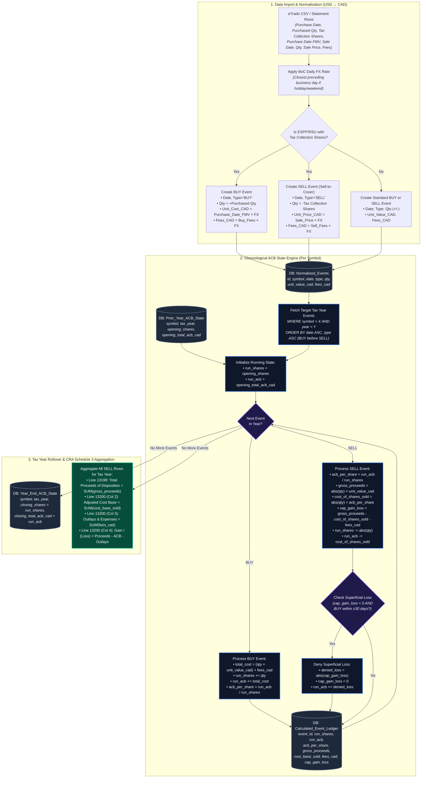

# Data Flow

```mermaid
flowchart TD
%% Styling
classDef db fill:#1e293b,stroke:#64748b,stroke-width:2px,color:#f8fafc
classDef process fill:#0f172a,stroke:#3b82f6,stroke-width:2px,color:#f8fafc
classDef decision fill:#1e1b4b,stroke:#8b5cf6,stroke-width:2px,color:#f8fafc
classDef output fill:#064e3b,stroke:#10b981,stroke-width:2px,color:#f8fafc

    %% Stage 1: Import & Normalization
    subgraph S1 ["1. Data Import & Normalization (USD → CAD)"]
        Raw["eTrade CSV / Statement Rows<br/><i>(Purchase Date, Purchased Qty, Tax Collection Shares,<br/>Purchase Date FMV, Sale Date, Qty, Sale Price, Fees)</i>"]
        FX["Apply BoC Daily FX Rate<br/><i>(Closest preceding business day if holiday/weekend)</i>"]
        Split{"Is ESPP/RSU with<br/>Tax Collection Shares?"}

        EvtBuy["Create BUY Event<br/>• Date, Type='BUY'<br/>• Qty = +Purchased Qty<br/>• Unit_Cost_CAD = Purchase_Date_FMV × FX<br/>• Fees_CAD = Buy_Fees × FX"]
        EvtSellTax["Create SELL Event (Sell-to-Cover)<br/>• Date, Type='SELL'<br/>• Qty = -Tax Collection Shares<br/>• Unit_Price_CAD = Sale_Price × FX<br/>• Fees_CAD = Sell_Fees × FX"]
        EvtStd["Create Standard BUY or SELL Event<br/>• Date, Type, Qty (+/-)<br/>• Unit_Value_CAD, Fees_CAD"]

        Raw --> FX --> Split
        Split -- "Yes" --> EvtBuy & EvtSellTax
        Split -- "No" --> EvtStd
    end

    %% Database Storage 1
    DB_Events[("DB: Normalized_Events<br/><i>id, symbol, date, type, qty,<br/>unit_value_cad, fees_cad</i>")]:::db
    EvtBuy & EvtSellTax & EvtStd --> DB_Events

    %% Stage 2: Chronological Replay & ACB Engine
    subgraph S2 ["2. Chronological ACB State Engine (Per Symbol)"]
        LoadState[("DB: Prior_Year_ACB_State<br/><i>symbol, tax_year, opening_shares,<br/>opening_total_acb_cad</i>")]:::db

        QueryYear["Fetch Target Tax Year Events<br/><i>WHERE symbol = X AND year = Y<br/>ORDER BY date ASC, type ASC (BUY before SELL)</i>"]:::process

        InitVars["Initialize Running State:<br/>• run_shares = opening_shares<br/>• run_acb = opening_total_acb_cad"]:::process

        Loop{"Next Event<br/>in Year?"}:::decision

        CalcBuy["Process BUY Event:<br/>• total_cost = (qty × unit_value_cad) + fees_cad<br/>• run_shares += qty<br/>• run_acb += total_cost<br/>• acb_per_share = run_acb / run_shares"]:::process

        CalcSell["Process SELL Event:<br/>• acb_per_share = run_acb / run_shares<br/>• gross_proceeds = abs(qty) × unit_value_cad<br/>• cost_of_shares_sold = abs(qty) × acb_per_share<br/>• cap_gain_loss = gross_proceeds - cost_of_shares_sold - fees_cad<br/>• run_shares -= abs(qty)<br/>• run_acb -= cost_of_shares_sold"]:::process

        Superficial{"Check Superficial Loss<br/><i>(cap_gain_loss < 0 AND<br/>BUY within ±30 days?)</i>"}:::decision

        AdjustLoss["Deny Superficial Loss:<br/>• denied_loss = abs(cap_gain_loss)<br/>• cap_gain_loss = 0<br/>• run_acb += denied_loss"]:::process

        SaveAudit[("DB: Calculated_Event_Ledger<br/><i>event_id, run_shares, run_acb,<br/>acb_per_share, gross_proceeds,<br/>cost_base_sold, fees_cad, cap_gain_loss</i>")]:::db

        DB_Events --> QueryYear
        LoadState --> InitVars
        QueryYear --> InitVars
        InitVars --> Loop

        Loop -- "BUY" --> CalcBuy --> SaveAudit
        Loop -- "SELL" --> CalcSell --> Superficial
        Superficial -- "Yes" --> AdjustLoss --> SaveAudit
        Superficial -- "No" --> SaveAudit
        SaveAudit --> Loop
    end

    %% Stage 3: Year-End Rollover & Schedule 3 Output
    subgraph S3 ["3. Tax Year Rollover & CRA Schedule 3 Aggregation"]
        SaveEndState[("DB: Year_End_ACB_State<br/><i>symbol, tax_year, closing_shares = run_shares,<br/>closing_total_acb_cad = run_acb</i>")]:::db

        AggSched3["Aggregate All SELL Rows for Tax Year:<br/>• Line 13199: Total Proceeds of Disposition = SUM(gross_proceeds)<br/>• Line 13200 (Col 2): Adjusted Cost Base = SUM(cost_base_sold)<br/>• Line 13200 (Col 3): Outlays & Expenses = SUM(fees_cad)<br/>• Line 13200 (Col 4): Gain / (Loss) = Proceeds - ACB - Outlays"]:::output

        Loop -- "No More Events" --> SaveEndState & AggSched3
    end
```
